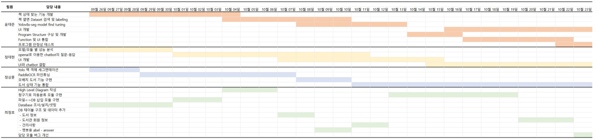

# Intel AI Edge Team project 1조

https://docs.google.com/presentation/d/11eHu6XhXAeMrRNQsAy2DfQQlQGY8WTk-GbzzGuaD-FM/edit#slide=id.g2a692d12221_0_316 

#### 프로젝트 주제 : 「 스마트 도서관 」 
### *도서관 이용객의 편리와 직원의 업무 경감/시간 절약 등을 위한 도서관 관리 시스템*

######                   1. 책장에 꽂혀있는 책을 자동적으로 관리하여 도서관의 사서의 업무 효율성 향상
######                   2. ChatBot 과 그림일기를 통하여 많은 사용자들이 쉽고 재밌게 도서관을 이용 할 수 있게 함

---
#### 프로젝트 수행 기간 : 24/09/26 ~ 24/10/23

---
#### 프로젝트 개발 동기 
###### 코로나 19 이후 인한 사회 전반에 걸친 급격한 변화는 도서관의 제공 서비스 영역에도 급격히 이뤄졌다.  사서의 업무 가중과 불특정 이용자 응대에 대한 정신적 스트레스 증가로 인해, 사서라는 직무를 기피하게 되고, 이로 인해 작은 도서관에서부터 사서가 없어 운영이 힘들어 지고 있는 것이 현실이다. 이러한 문제점들을 우리 스마트 도서관의 기술로 해결이 되고, 긍정적인 방향으로 변화가 일어났으면 싶다.
---
#### UseCase
*사서*
##### 1. 책장의 책이 실시간이 실시간으로 데이터베이스와 동기화가 된다
##### 2. 사용자가 책을 가져 가거나, 위치를 바꿨을 때, 해당 책의 상태를 도서관 사서에게 알려준다
##### 3. 찾고자 하는 책이 있을 때, 그 책이 어디에 있는지 실시간으로 알려준다.
##### 4. 책이 뒤죽박죽 섞여 있을 때, 사서가 일일이 판단을 하지 않고, AI가 책의 위치를 알려주어 업무의 효율을 높여준다.

*이용자*
##### 1. 이용자가 궁금한 사항이 있을 때, 챗봇을 이용해서 즉각 궁금한 점을 해결 할 수 있다.
##### 2. 글을 쓰면, 그림 일기로 만들어주는 기능을 통해 아이들의 책에 관한 흥미와 친밀함을 올려준다
---
#### High Level Diagram

---
#### Software Architecture

---
#### Flow Chart

---
#### 사용 Software Tools & Frameworks 
* Python
* Linux
* OpenCV
* PyTorch
* Yolov8x-seg (fine tuning)
* PaddleOCR (fine tuning)
* fuzzywuzzy
---
#### 프로젝트 개발 일정

---
#### 역할

---
#### 결과물
## 1. Main Program 
- 로그인 후 메인 프로그램으로 들어가게 됨. 
- 메인화면에서 카메라 2개를 이용해 책장 2개의 책들을 실시간 감지 하여 상태를 표시하고 있음

## 2. ChatBot 
- flask를 이용해 pc버전을 모바일로 실행 시켜 동작하고 있음

## 3. 건의사항 기능 
- 이용자가 Chatbot을 이용해 도서관 건의사항을 적게 되면, 실시간으로 Main Program에서 알 수 있음.
- Cam 2번을 통해 사용자가 chatbot을 이용해 건의사항을 작성 하고 있는 모습이 보임
- 건의 사항 버튼을 누르면 건의사항 목록이 표시 됨

## 4. 신간 등록 기능 
- 도서관 사서가 신간 등록 버튼을 누르고, 신간 db excel 파일을 업로드 하면, 자동으로 db에 등록
   

---
#### 추가 수정 예정
* 프로그램 구조 변경
* 프로그램 안정성
* 책 상태 기능 개선
* 분류 기호 세분화 적용
* PaddleOCR Model 개선
* ChatBot 개선
